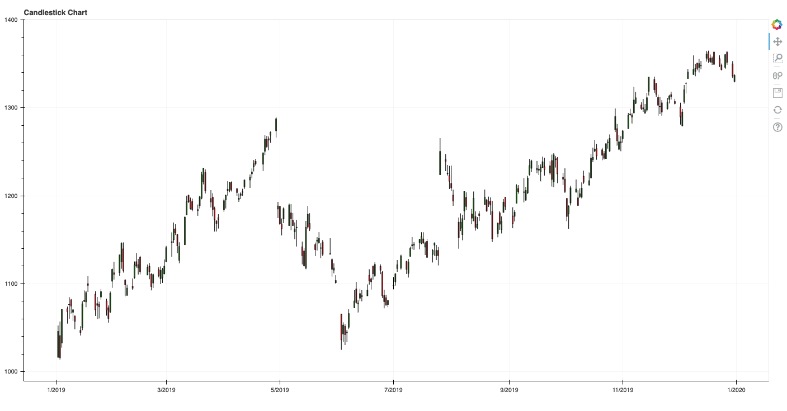

# Financial Graph. Stock Analysis
Data Visualisation in bokeh 
Script was created in Jupyter Notebook. It takes data from yahoo for Google shares and represents stock analysis.

### Installing
pip3 install pandas-datareader
pip3 install bokeh

### Libraries 
*pandas_datareader 
*datatime 
*bokeh.plotting

### Running 
python3 stock_analysis.py

### Outcome in Bokeh

